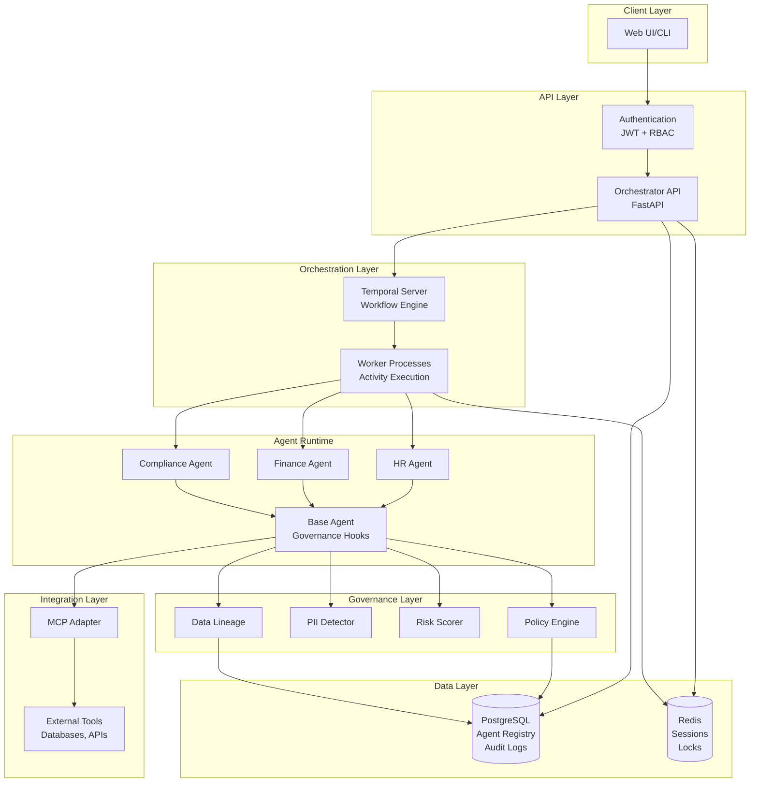

# Enterprise Agent Orchestrator

A production-ready reference architecture for orchestrating specialized AI agents with enterprise governance, compliance, and observability.

[](https://github.com/your-org/enterprise-agent-orchestrator/actions)
[](https://codecov.io/gh/your-org/enterprise-agent-orchestrator)
[](https://www.python.org/downloads/)

## Executive Summary

This project demonstrates how to build a scalable, governed, and auditable platform for deploying AI agents in enterprise environments. It addresses the core challenges of autonomous agent deployment: workflow reliability, policy enforcement, audit compliance, and operational visibility.

**Key Outcomes:**

- **Risk Reduction:** Multi-layer governance prevents unauthorized data access and policy violations
- **Operational Confidence:** Durable workflows with automatic retries and rollback capabilities
- **Regulatory Compliance:** Complete audit trail for SOX, GDPR, and HIPAA requirements
- **Development Velocity:** Standardized agent interfaces and deployment pipelines reduce time-to-production
- **Cost Efficiency:** Reusable governance components eliminate duplicate effort across teams

## Architecture



## Key Features

### 1. Workflow Orchestration

- **Durable Execution:** Workflows survive process crashes and network failures
- **Automatic Retries:** Configurable retry policies with exponential backoff
- **Compensation Logic:** Automatic rollback on failure with saga pattern
- **Observability:** Complete workflow history and execution timeline

**Implementation:** [Temporal workflows](apps/worker/workflows/) with Python SDK

### 2. Multi-Layer Governance

- **Policy Engine:** Declarative policies evaluated at runtime (YAML/JSON)
- **PII Detection:** Automatic identification and redaction of sensitive data
- **Risk Scoring:** Multi-dimensional risk assessment for deployments
- **Data Lineage:** Complete provenance tracking for compliance

**Implementation:** [Governance SDK](packages/governance-sdk/)

### 3. Role-Based Access Control

- **User Roles:** Admin, Developer, Approver, Viewer
- **Approval Workflows:** Multi-level approval for high-risk agents
- **Audit Logging:** Every action logged with user attribution
- **JWT Authentication:** Secure token-based authentication

**Implementation:** [Security module](apps/orchestrator/security.py)

### 4. Agent Lifecycle Management

- **Registration:** Submit agents with configuration and capabilities
- **Approval:** Risk-based approval routing
- **Deployment:** Managed deployment with health checks
- **Monitoring:** Real-time status and metrics
- **Rollback:** One-click rollback to previous version

**Implementation:** [Agent endpoints](apps/orchestrator/routers/agents.py)

### 5. Standardized Tool Integration

- **Model Context Protocol (MCP):** Industry-standard agent-tool integration
- **Dynamic Discovery:** Agents query available tools at runtime
- **Type Safety:** JSON Schema validation for inputs/outputs
- **Audit Trail:** All tool invocations logged

**Implementation:** [MCP adapter](packages/mcp-adapter/)

## Technology Stack

| Layer | Technology | Rationale |
|-------|-----------|-----------|
| **API** | FastAPI + Uvicorn | Async performance, OpenAPI docs, type validation |
| **Workflows** | Temporal | Durable execution, proven at scale (Uber, Netflix) |
| **Database** | PostgreSQL 16 | ACID compliance, JSON support, proven reliability |
| **Cache** | Redis 7 | High performance, distributed locking |
| **Language** | Python 3.12+ | Rich ecosystem, type hints, async support |
| **ORM** | SQLModel | Type-safe queries, Pydantic integration |
| **Testing** | pytest + httpx | Async support, fixtures, 90%+ coverage |
| **Deployment** | Docker + ECS | Containerization, serverless orchestration |
| **IaC** | Terraform | Declarative infrastructure, AWS support |

See [Architecture Decision Records](docs/adr/) for detailed technology choices.

## Quick Start

### Prerequisites

- Python 3.12+
- Docker Desktop
- 4 GB RAM minimum

### One-Command Setup

```bash
git clone https://github.com/your-org/enterprise-agent-orchestrator.git
cd enterprise-agent-orchestrator
make dev-setup
```

This command:
1. Installs dependencies
2. Starts PostgreSQL, Redis, Temporal
3. Runs database migrations
4. Seeds demo data

**Setup time:** ~5 minutes

### Start Services

Terminal 1 (API):
```bash
make run
# API available at http://localhost:8000
```

Terminal 2 (Worker):
```bash
python -m apps.worker.main
```

### Run Demo

```bash
python scripts/demo.py
```

This runs an end-to-end agent deployment demonstrating:
- User authentication
- Agent registration
- Approval workflow
- Deployment with Temporal
- Rollback scenario

See detailed setup: [Local Development Guide](docs/runbooks/local-setup.md)

## Project Structure

```
enterprise-agent-orchestrator/
├── apps/
│   ├── orchestrator/       # FastAPI application
│   │   ├── main.py         # App entry point
│   │   ├── routers/        # API endpoints
│   │   ├── security.py     # Auth & RBAC
│   │   └── audit.py        # Audit logging
│   ├── worker/             # Temporal worker
│   │   ├── workflows/      # Workflow definitions
│   │   └── activities/     # Activity implementations
│   └── agent-runtime/      # Agent execution
│       ├── base_agent.py   # Base agent class
│       └── agents/         # Specialized agents
├── packages/
│   ├── domain-models/      # SQLModel entities
│   ├── governance-sdk/     # Policy, PII, risk
│   └── mcp-adapter/        # MCP client/server
├── infra/
│   ├── docker/             # Docker Compose
│   ├── terraform/          # AWS deployment
│   └── postgres/           # DB init scripts
├── docs/
│   ├── adr/                # Architecture decisions
│   └── runbooks/           # Operational guides
├── scripts/
│   ├── setup.sh            # One-command setup
│   ├── seed_demo_data.py   # Demo data
│   ├── health_check.py     # Service health
│   └── demo.py             # E2E demo
└── tests/                  # 90%+ coverage
    ├── test_orchestrator/
    ├── test_governance/
    ├── test_agent_runtime/
    └── conftest.py
```

## Governance Model

### Policy Evaluation

Policies are evaluated at three checkpoints:

1. **Agent Registration:** Validate configuration and capabilities
2. **Deployment:** Check risk score and compliance requirements
3. **Runtime:** Enforce data access and action permissions

Example policy:

```yaml
name: "PII Access Control"
scope: "agent"
priority: 100
rules:
  - rule_type: "pii_detection"
    condition:
      requires_scanning: true
    action: "review"
    severity: "high"
```

### Risk Scoring

Agents receive a composite risk score (0.0 to 1.0) based on:

- **Data Sensitivity:** Classification level, PII access, volume
- **Operational Impact:** Write operations, user-facing, integrations
- **Compliance:** Regulatory frameworks (SOX, GDPR, HIPAA)
- **Technical Complexity:** Dependencies, custom code, integration points
- **Deployment History:** Failure rate, rollbacks

Approval thresholds:
- **< 0.25:** Auto-approve
- **0.25-0.50:** Single approver
- **0.50-0.75:** Multi-level approval
- **> 0.75:** Executive approval + audit review

### Audit Trail

Every action generates an immutable audit log entry:

```json
{
  "event_type": "agent.deployed",
  "resource_id": "uuid",
  "user_id": "uuid",
  "action": "deploy",
  "timestamp": "2024-01-15T10:30:00Z",
  "details": {
    "environment": "production",
    "risk_score": 0.45
  }
}
```

Retention: 7 years (configurable for compliance)

## Production Deployment

### AWS Architecture

- **Compute:** ECS Fargate (orchestrator API + worker)
- **Database:** RDS PostgreSQL (Multi-AZ)
- **Cache:** ElastiCache Redis (cluster mode)
- **Load Balancer:** Application Load Balancer with TLS
- **Networking:** VPC with public/private subnets
- **Monitoring:** CloudWatch metrics and logs

### Deployment Steps

```bash
cd infra/terraform
terraform init
terraform plan -out=tfplan
terraform apply tfplan
```

See [Production Deployment Guide](docs/runbooks/deployment.md)

### Estimated Costs

| Component | Configuration | Monthly Cost |
|-----------|--------------|--------------|
| RDS PostgreSQL | db.r6g.large | $200 |
| ElastiCache Redis | cache.r6g.large | $150 |
| ECS Fargate | 2 tasks (2 vCPU, 4 GB) | $100 |
| ALB | Standard | $20 |
| Data Transfer | 100 GB | $10 |
| **Total** | | **~$480** |

Cost optimization options in [deployment guide](docs/runbooks/deployment.md).

## Testing

Run full test suite:

```bash
make test
```

Expected output:
```
======== test session starts ========
collected 87 items

tests/test_orchestrator/test_agents.py ............ [ 12%]
tests/test_governance/test_policy_engine.py ...... [ 19%]
tests/test_governance/test_pii_detector.py ....... [ 27%]
tests/test_governance/test_risk_scorer.py ........ [ 36%]
...

---------- coverage: 92% ----------
```

Coverage target: 90%

## Code Quality

```bash
make lint      # Ruff linting
make format    # Auto-format code
make typecheck # Mypy type checking
```

Pre-commit hooks automatically run on every commit.

## API Documentation

Interactive API docs available at:
- **Swagger UI:** http://localhost:8000/docs
- **ReDoc:** http://localhost:8000/redoc

Key endpoints:
- `POST /users/login` - Authenticate
- `POST /agents/` - Register agent
- `POST /agents/{id}/submit-approval` - Submit for approval
- `POST /agents/{id}/approve` - Approve agent (admin)
- `POST /deployments/` - Deploy agent
- `POST /deployments/{id}/rollback` - Rollback deployment

## Monitoring

### Health Checks

```bash
python scripts/health_check.py
```

### Temporal UI

View workflow execution history:
- **URL:** http://localhost:8080
- **Workflows:** Agent lifecycle, cross-agent coordination
- **Features:** Replay, stack traces, event history

### Metrics

Key metrics to monitor:
- API latency (p50, p95, p99)
- Error rate (< 1%)
- Workflow success rate (> 95%)
- Database connection pool utilization
- Cache hit rate (> 80%)

## Security Considerations

### Authentication & Authorization

- JWT tokens with configurable expiration
- Password hashing with bcrypt
- Role-based access control (RBAC)
- Principle of least privilege

### Data Protection

- Encryption at rest (RDS, ElastiCache)
- Encryption in transit (TLS 1.3)
- PII detection and redaction
- Data classification enforcement

### Network Security

- Private subnets for databases
- Security groups (allow-list only)
- No hardcoded credentials
- Secrets in AWS Secrets Manager

### Compliance

- **SOX:** Complete audit trail, change control
- **GDPR:** Data lineage, right to erasure, consent tracking
- **HIPAA:** BAA with AWS, encryption, access logs

## Troubleshooting

See [Incident Response Runbook](docs/runbooks/incident-response.md) for:

- Common failure scenarios
- Diagnostic procedures
- Rollback procedures
- Escalation contacts

Quick diagnostics:

```bash
# Check service health
python scripts/health_check.py

# View logs
docker compose -f infra/docker/docker-compose.yml logs -f

# Access database
docker exec -it enterprise-agents-postgres psql -U user -d enterprise_agents
```

## Contributing

We welcome contributions! Please follow these guidelines:

### Development Workflow

1. Fork the repository
2. Create a feature branch (`git checkout -b feature/amazing-feature`)
3. Make your changes with tests
4. Run quality checks (`make lint && make typecheck && make test`)
5. Commit with descriptive message
6. Push to your fork
7. Open a pull request

### Code Standards

- **Type Hints:** All public functions must have type annotations
- **Documentation:** Docstrings for all modules, classes, and public functions
- **Testing:** 90%+ coverage required, tests for new features
- **Style:** Follow Ruff formatting and linting rules
- **Commits:** Clear, descriptive commit messages

### Pull Request Process

1. Ensure all tests pass
2. Update documentation for new features
3. Add entry to CHANGELOG.md
4. Request review from maintainers

## License

MIT License. See [LICENSE](LICENSE) for details.

## Support

- **Issues:** [GitHub Issues](https://github.com/your-org/enterprise-agent-orchestrator/issues)
- **Documentation:** [docs/](docs/)
- **Discussions:** [GitHub Discussions](https://github.com/your-org/enterprise-agent-orchestrator/discussions)

## Acknowledgments

This project builds on excellent open-source technologies:

- [Temporal](https://temporal.io/) - Durable workflow orchestration
- [FastAPI](https://fastapi.tiangolo.com/) - Modern Python web framework
- [SQLModel](https://sqlmodel.tiangolo.com/) - SQL databases with Python
- [Pydantic](https://pydantic.dev/) - Data validation

## Roadmap

### Phase 1 (Current)
- ✅ Core orchestration platform
- ✅ Governance SDK
- ✅ MCP integration
- ✅ Reference agents (HR, Finance, Compliance)

### Phase 2 (Next Quarter)
- [ ] Web-based UI for agent management
- [ ] Advanced policy editor
- [ ] Real-time metrics dashboard
- [ ] Multi-cloud support (Azure, GCP)

### Phase 3 (Future)
- [ ] ML-based anomaly detection
- [ ] Auto-scaling based on workload
- [ ] Multi-tenancy support
- [ ] Advanced workflow patterns (fan-out, saga)

See [ROADMAP.md](ROADMAP.md) for detailed plans.

---

**Built with ❤️ for enterprise AI deployments**
